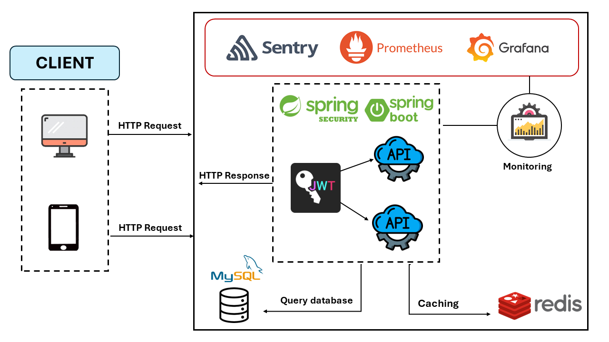

# Recruitment Backend API Project
[](https://github.com/kaitechvn/Recruitment-App)
[](https://github.com/kaitechvn/Recruitment-App)
[](tel:+8436782589)
[](mailto:khaibui2604@gmail.com)
## Table of Contents

- [Introduction](#introduction)
- [Technologies](#technologies)
- [Architecture](#architecture)
- [Features](#features)
- [Installation](#installation)
- [Demo](#demo) 


## Introduction
This project focuses on the recruitment domain, aiming to design and implement a comprehensive API system for managing various recruitment-related operations.
It serves as a mock project intended to enhance backend programming skills and provide hands-on experience in developing RESTful API using modern technologies.

## Technologies
[](https://www.java.com/)
[](https://spring.io/projects/spring-boot)
[](https://spring.io/projects/spring-security)
[](https://www.mysql.com/)
[](https://redis.io/)

- **Java** - version 17 
- **Spring Boot** - version 3.2.5
- **Spring Securiy** - version 3.2.5 
- **MySQL** - version 8.0.36
- **Redis** - version 7.2.1

## Architecture


## Features
- Perform CRUD operations
- Provide analytical APIs for insights
- Secure APIs with authorization mechanisms using JWT
- Implement caching service to improve performance
- Create log for tracking and debugging
- Monitor application system using Prothemeus, Grafana, Sentry

## Installation
Follow these steps to get the project up and running on your local machine. Use your command line for setting up

### Prerequisites
- Java 17 or higher
- MySQL 
- Mongosh - for MongoDB
- Maven 
- Docker 

### Setup
**1. Clone the repository**
   ```bash
   $ https://github.com/kaitechvn/Recruitment-App.git
   cd Recruitment-App
   ```
**2. Run virtual machine**
   ```bash
   $ docker compose up -d 
   ```
**3. Add data config to MySQL and MongoDB**

*MySQL*
   ```bash
   $ docker exec -i recruitment-app-mysql-db-1 sh -c 'exec mysql -uroot -p"Khai2604@" -e "CREATE DATABASE job_db;"'
   $ docker exec -i recruitment-app-mysql-db-1 sh -c 'exec mysql -uroot -p"Khai2604@" job_db' < recruitment.sql
   ```
*MongoDB*
   ```bash
   $ docker exec -it recruitment-app-mongodb-1 mongosh --username root --password Mongo@123 --authenticationDatabase admin
   use sample_db
   ```
   ```bash
   db.createUser({
   user: 'user',
   pwd: 'User123',
   roles: [{ role: 'readWrite', db: 'sample_db' }]
   });
   ```

   
**4. Run the application**
   ```bash
   $ mvn clean install
   $ java -jar target/recruitment-0.0.1-SNAPSHOT.jar
   ```

## Demo
Use Postman or Curl through terminal for http request
```bash
curl -X POST \
  http://localhost:8080/auth/login \
  -H 'Content-Type: application/json' \
  -d '{
    "username": "admin",
    "password": "adminpassword"
}'
```
After this, take the token in reponse body to invoke another API request

**Link**

**Swagger UI Documentation for API** http://localhost:8080/swagger-ui/index.html


**Grafana UI Monitoring application system** http://localhost:3000/

**Prothemeus UI Metric** http://localhost:9090/


     
